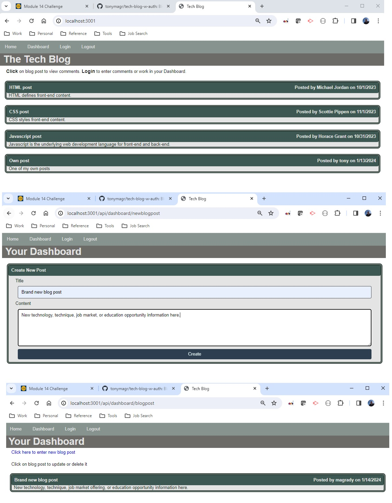

# Tech Blog with Auth

## Author
Tony Magrady - Berkeley Full-Stack Web Development Bootcamp student, Fall-Winter Session 2023-2024

## Badges

## Table of Contents

- [Description](#description)
- [Installation](#installation)
- [Usage](#usage)
- [Credits](#credits)
- [License](#license)

## Description

This is a content management system (CMS) blog site where developers can publish and manage their blog posts and comment on other developers’ posts. This app follows the Model-View-Controller (MVC) pattern for client requests handled by server routes which access the Sequelize database (connected to PostgreSQL). Handlebars.js is used as the templating (extended HTML) language.  
Two levels of access are provided, described in Usage section.

## Installation

Required Node.js packages for this application are:
- Express (web app framework)
- PostgreSQL (database access)
- Sequelize (object-relational mapping, ORM, of code to PostgreSQL)
- Dotenv (manages private environment variables for use in code)
- Bcrypt (password hashing tool)
- Express-handlebars (client-side templating language for HTML)
- Express-session (saves and manages session data, including auth data)  

CLI server command in repo:  npm run watch  
Client URL for app home page is:  http://localhost:5432/

## Usage

Two levels of access are provided, depending on if the user signs up to the application and/or later logs on. Logged in users have access to their own dashboard to create their own blog posts and later update or delete them. Everyone else has basic access to view others' blog posts and comments.  

## Credits

Modeled from Module 14 - MVC boot camp exercise starter code.

## License

The MIT License

Copyright (c) (2023) (Tony Magrady)

    Permission is hereby granted, free of charge, to any person obtaining a copy
    of this software and associated documentation files (the "Software"), to deal
    in the Software without restriction, including without limitation the rights
    to use, copy, modify, merge, publish, distribute, sublicense, and/or sell
    copies of the Software, and to permit persons to whom the Software is
    furnished to do so, subject to the following conditions:
    
    The above copyright notice and this permission notice shall be included in all
    copies or substantial portions of the Software.
    
    THE SOFTWARE IS PROVIDED "AS IS", WITHOUT WARRANTY OF ANY KIND, EXPRESS OR
    IMPLIED, INCLUDING BUT NOT LIMITED TO THE WARRANTIES OF MERCHANTABILITY,
    FITNESS FOR A PARTICULAR PURPOSE AND NONINFRINGEMENT. IN NO EVENT SHALL THE
    AUTHORS OR COPYRIGHT HOLDERS BE LIABLE FOR ANY CLAIM, DAMAGES OR OTHER
    LIABILITY, WHETHER IN AN ACTION OF CONTRACT, TORT OR OTHERWISE, ARISING FROM,
    OUT OF OR IN CONNECTION WITH THE SOFTWARE OR THE USE OR OTHER DEALINGS IN THE
    SOFTWARE.